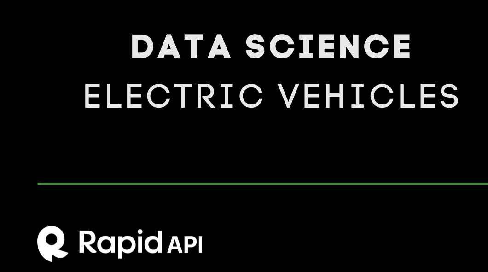

# Electric Vehicle Adoption Analysis for Saudi Market

<picture></picture>

## 1. Problem Overview

As the CEOs/Founders of a startup focused on the adoption of electric vehicles (EV) in the Saudi market, aligning with Saudi Arabia's Vision 2030 to accelerate the transition to sustainable transportation, we aim to understand the factors influencing consumer preferences, adoption rates, and overall market trends for electric vehicles. To effectively navigate this landscape, our strategies must be grounded in robust data analysis and market insights. Addressing five key questions derived from the data collected will enable us to overcome challenges and make informed decisions.

## 2. Data Source

**Source:** [Electric Vehicle Data API Documentation (adrienpelletierlaroche) | RapidAPI](https://rapidapi.com)

**API Documentation:** [ElectricVehicleData API](https://electric-vehicle-data-documentation.netlify.app)

The Electric Vehicle Data API, hosted on RapidAPI, furnishes vital information on electric vehicles, such as VIN, location, model specifics, electric range, and pricing. RapidAPI serves as a marketplace platform for APIs, assisting developers in discovering, connecting to, and managing numerous APIs. This facilitates the seamless integration of data and services into applications, proving particularly valuable for stakeholders in the EV sector for strategic and operational planning.

## 3. About Data

The Electric Vehicle Data API provides a comprehensive dataset on electric vehicles, crucial for our analysis. The dataset encompasses specific details for each electric vehicle, where each row represents an individual EV, including attributes such as:

- **County:** The vehicle's registered county, shedding light on regional EV distribution and adoption.
- **City:** Registration city, offering a detailed view of EV distribution.
- **Model Year:** Manufacturing year, vital for trend analysis in EV technology and adoption.
- **Make:** The vehicle's manufacturer or brand, indicating market leaders in the EV industry.
- **Model:** Specific vehicle model, aiding in understanding consumer preferences and model performance.
- **Electric Range:** Maximum distance per charge, a key usability and technology metric.
- **Electric Vehicle Type:** Differentiates between Battery Electric Vehicle (BEV) and Plug-in Hybrid Electric Vehicle (PHEV).
- **Electric Utility:** Charging utility provider(s), indicating charging infrastructure availability.

## 4. Dataset Overview

The dataset predominantly consists of qualitative attributes (city, county, model year, make, model, electric vehicle type, electric utility), with electric range being the sole quantitative attribute. This allows for measurement and comparison on a ratio scale.

## 5. Questions

Exploration of the dataset will address the following questions:

1. Which country has the highest adoption of electric vehicles?
2. What are the trends in EV adoption over time?
3. How does EV adoption vary by geographic location?
4. Which manufacturers and models are most popular among EV owners?
5. How does the availability of electric utilities impact EV distribution?
6. Is there a correlation between energy consumption and electric range?
7. What is the relationship between electric vehicle range and vehicle type?

By delving into these inquiries, we can gain valuable insights to guide our market strategies and contribute to the sustainable transportation goals outlined in Vision 2030.
## Tools 

